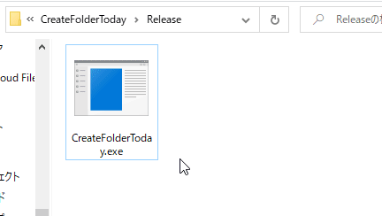

# Create Today's directory

今日の日付のフォルダを作成してくれます。

Just double click this application,  you can create a directory named string of today !

## Download

Windows 32bit binary (exe) :

[Release/CreateFolderToday.exe](Release/CreateFolderToday.exe)

## Customize

You can change format of created folder name with arguments.

`\> .\CreateFolderToday.exe ""%Y%m%d%H%M%S"`

use strftime formats.

## Environment

- C++
- Visual Studio 2017
